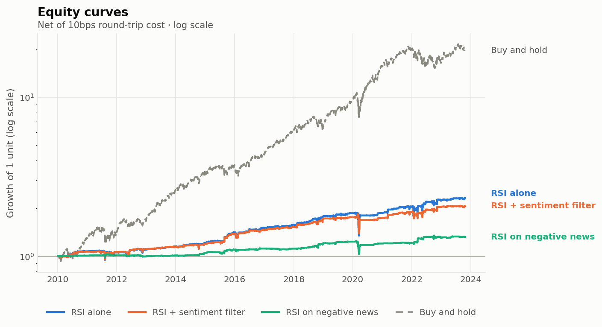

# Does news sentiment improve a dip-buying strategy?

A study of 84 large US companies, 2010–2023, using 103,036 news articles — with trading
costs included.


## The idea

Some shares fall for no particular reason — a large holder needed cash that day, and there
weren't enough buyers at that moment. Those tend to bounce back. Other shares fall because
something genuinely happened: bad earnings, a lawsuit, a failed product. Those don't
bounce, because the lower price is correct.

**If you could tell the two apart, you would only buy the first kind.**

This tests whether news sentiment can tell them apart. The strategy buys shares that have
fallen sharply, but skips the ones where the news that day was bad.

## The finding

**It doesn't work.** Skipping the bad-news dips made things slightly worse:

- Buying every dip: **6.28%** a year
- Buying dips but skipping bad-news ones: **5.42%** a year

### Why it doesn't work

Because the sentiment signal doesn't predict anything to begin with.

Checked directly: on each day, rank every company by how positive its news was, then see
whether the better-rated ones did better over the following week. They didn't. The most
negative fifth returned +0.49%. The most positive fifth returned +0.49%. Flat.

**You cannot filter using a signal that carries no information.** That's the result, and
it explains the outcome rather than just reporting it.

### The test designed to prove the idea wrong

A fourth version buys *only* the dips the filter rejects — the ones with bad news. If the
theory held, these should be the worst trades in the study.

They weren't. They returned **+0.91% per trade**, against **+0.79%** for the trades the
filter kept. The trades the theory said to avoid were slightly better ones.

Building the version that could prove you wrong, rather than only the version that might
prove you right, is what makes the conclusion trustworthy.

### One real effect did survive

The filter didn't improve average returns, but it did reduce the worst outcomes. The
largest peak-to-trough loss improved from −28.5% to −24.3%, and the single worst trade
from −54.8% to −31.4%.

So it buys you a smoother ride, not a better return. That's a trade-off, not an advantage.

### And nothing beat simply buying and holding

Holding all 84 companies returned **24% a year**. The best strategy returned 6%.

Part of that is because the strategy sits in cash most of the time — it holds about 3 of
its 20 available slots on average. But even adjusting for that, buy-and-hold wins. Measured
as return per unit of risk (the **Sharpe ratio** — annual return divided by how much the
returns bounce around), it's 1.15 against 0.56.

📄 **[Read the full write-up](notes/research-note.md)**



---

## Why publish a result that didn't work

Most trading strategies posted publicly claim to work. Most are wrong, usually for one of
three reasons: they accidentally used information that wasn't available at the time, they
ignored trading costs, or they tried many versions and published the one that happened to
look good.

This was built so none of those could happen. The honest answer is that the idea doesn't
work — which is more useful than another strategy claiming returns it can't support.

---

## The four versions tested

| Version | What it buys | Why it's here |
|---|---|---|
| **RSI alone** | Any share that has fallen sharply | Does dip-buying work at all? |
| **Sentiment alone** | Any share with positive news | Does sentiment work on its own? |
| **RSI + filter** | Fallen shares, *unless* the news is bad | **The actual idea** |
| **RSI on bad news** | Fallen shares *only when* the news is bad | **The test designed to disprove it** |

Plus buying and holding everything, as the benchmark.

**RSI** is a standard measure between 0 and 100 of how much a share has risen or fallen
recently. Below 30 means it has dropped sharply. It isn't predictive on its own — it's a
consistent, mechanical way of saying "this has fallen".

A company with *no* news counts as a normal dip and passes the filter, since the theory
says an unexplained fall is the kind worth buying.

---

## How the study avoids fooling itself

Three rules do most of the work, and each is enforced by a test rather than just stated.

**Nothing is traded before it is known.** A signal appearing at Monday's close is traded at
Tuesday's opening price, never Monday's. Two tests enforce this: one checks no position can
open before its signal exists, and one changes the final 20 days of prices and confirms
every earlier day's result is unchanged. Both were verified by deliberately introducing a
same-day-trading bug and confirming the tests caught it.

News works the same way. A story dated Monday is only tradeable from Tuesday — and since
the articles carry dates but not times, there's no way to know whether a story broke before
the market opened or after it closed.

**Trading costs are charged**, and the whole study is reported at 0, 5, 10 and 20 basis
points per round trip (a basis point is one hundredth of a percent). This matters a lot for
one version: sentiment-alone had the *best* risk-adjusted return of anything at zero cost,
and went negative by 20 basis points, because it traded 38,000 times. Reported without
costs, it would have looked like a winner.

**Nothing was tuned.** Every setting is a standard textbook value fixed before the study
ran — RSI of 14 with thresholds at 30 and 70 is the original 1978 definition, and the
five-day holding period is the conventional one. There was no optimisation, so there is
nothing that could have been overfitted to the data.

Money is split into 20 equal slots, one per position, with unused slots earning nothing.
The alternative — splitting capital across however many positions happen to be open —
quietly increases risk whenever few signals fire, and makes the comparison against
buy-and-hold meaningless.

---

## Data

| | |
|---|---|
| News | 103,036 articles, 2010–2023, from a public dataset |
| Share prices | Daily, adjusted for splits and dividends |
| Companies | 84 large US companies |
| Sentiment | FinBERT, a language model trained to read financial text |

Sentiment is scored continuously from −1 to +1 rather than as positive/negative/neutral, so
a barely-positive story and a strongly positive one aren't treated the same.

### What this study can't tell you

- **Survivorship.** The company list comes from a recent index, so firms that failed or
  were taken over are missing. Two of them — EA and Walgreens — stopped trading during the
  period studied, which is the bias happening in miniature.
- **Sector concentration.** The list is technology-heavy. Those companies move together, so
  84 of them carry less independent information than 84 unrelated companies would.
- **Coverage.** News coverage favours large companies and eventful days. A company with no
  article isn't a company where nothing happened.
- **The sentiment model is imperfect.** FinBERT rates roughly 40% of financial news as
  clearly positive against 11% clearly negative. A model that thinks most news is good news
  has limited room to flag the bad. It also calls "Apple traded flat" 92% negative.
- **One market, one period.** US large companies during an unusually strong decade.

---

## Tests

```bash
pip install -r requirements-dev.txt
pytest -q
```

99 tests, no internet or model downloads needed.

The most important ones check that the study can't see the future, and they were verified
by deliberately breaking the code to confirm they catch it. Others check the RSI
calculation against a separately written version of the same formula, confirm the
statistics against a standard library, and walk a single trade through day by day against
hand arithmetic — so the equity curve is provably made of the trades it claims.

## Running it

```bash
pip install -r requirements.txt
python -m study.run --smoke     # 5 companies, quick
python -m study.run             # everything
```

Every figure in the write-up is generated from the results file rather than typed in, so it
can't fall out of date. Scoring all 103,036 articles takes about two hours on a normal
laptop and is saved as it goes, so it can resume if interrupted.

```
study/
├── config.py      every setting, in one place
├── data.py        news and share prices
├── signals.py     RSI and sentiment scoring
├── backtest.py    the simulation
├── metrics.py     performance statistics
├── validation.py  does the sentiment signal predict anything?
└── run.py
```
