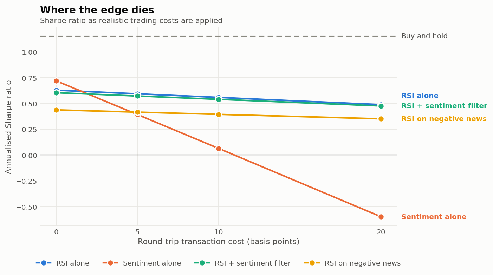
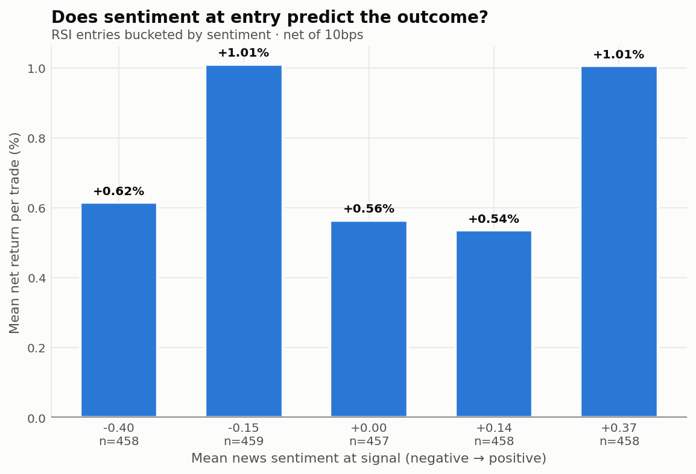

# Does news sentiment improve an RSI mean-reversion signal?

**A walk-forward study on {{config.tickers}} US large caps, {{config.start}} to {{config.end}}, with transaction costs.**

Lorenz Huber · [github.com/LCS3002/rsi-sentiment-study](https://github.com/LCS3002/rsi-sentiment-study)

> Every figure in this note is generated from `results/results.json` by `study/note.py`.
> None is transcribed by hand, and `python -m study.note --check` fails if the note and
> the results have drifted apart.

---

## Summary

<!-- FILL: the finding, in four or five sentences. Lead with the answer, not the setup. -->

---

## 1. The question, and why it might have an answer

Short-term RSI mean reversion buys names that have fallen. The strategy is old, well
documented, and usually attributed to liquidity provision rather than prediction: a seller
who needs to transact quickly pays whoever is willing to take the other side, and the
price reverts once that pressure clears. Nagel (2012) makes this case directly, showing
that reversal returns behave like compensation for supplying liquidity, and that they rise
when liquidity is scarce.

That account has an immediate implication. If the return comes from absorbing *uninformed*
selling pressure, then it should not be there when the selling is informed — when the
price fell because something happened and the new price is correct. Buying that dip is not
liquidity provision; it is standing in front of news.

**Hypothesis.** An oversold reading is a buy when the decline is uninformed and a trap when
it is informed. Conditioning RSI entries on news sentiment should therefore raise the hit
rate and cut the left tail, at the cost of fewer trades.

Tetlock (2007) supplies the other half: media pessimism carries information about returns,
which is what makes news sentiment a candidate proxy for "was this decline informed?" in
the first place.

Neither idea is mine. What this note contributes is a measurement of whether the
combination survives contact with transaction costs — and a test of whether it works
through the channel the hypothesis claims, rather than by coincidence.

### The four arms

The comparison is the result, so each arm isolates one thing.

| Arm | Entry rule | What it tests |
|---|---|---|
| **RSI alone** | RSI(14) < 30 | The baseline reversal signal |
| **Sentiment alone** | sentiment > +{{config.sentiment_threshold}} | Sentiment with no reversal signal |
| **RSI + sentiment filter** | RSI < 30 **and not** sentiment < −{{config.sentiment_threshold}} | **The hypothesis** |
| **RSI on negative news** | RSI < 30 **and** sentiment < −{{config.sentiment_threshold}} | **The falsification arm** |

The fourth arm is what makes this falsifiable. It trades precisely the entries the filter
removes. If the mechanism is real, it should be materially worse than the filtered arm. If
the two are indistinguishable, the filter is not working through the channel the hypothesis
describes — whatever the headline Sharpe happens to be.

A name with no news is treated as *uninformed* and passes the filter, because that is what
the hypothesis says to do with a dip nobody wrote about. The falsification arm requires
actual negative coverage and so excludes it.

---

## 2. Data

| | |
|---|---|
| News | 103,036 articles, {{config.start}} to {{config.end}} |
| Universe | {{config.tickers}} US large caps |
| Observations | {{config.ticker_days:int}} ticker-days |
| Bars | yfinance daily, split- and dividend-adjusted |
| Sentiment | `ProsusAI/finbert`, continuous `p_positive − p_negative`, EWMA half-life {{config.sentiment_halflife_days}} days |

Bars come from yfinance rather than the news corpus's own bundled price columns, so the
adjustment basis is known and real **opens** are available. `auto_adjust=True` adjusts
open, high, low and close on one basis; mixing an adjusted close with a raw open would
manufacture a return at every split in the sample.

Two names in the corpus — EA and WBA — no longer resolve at all, both having been taken
private in 2025. They are excluded. That is worth stating plainly rather than quietly
dropping, because it is survivorship bias happening in miniature and in public: a universe
assembled from a recent index membership has already lost the companies that left.

---

## 3. Method

Three commitments do most of the work. Each is enforced by a test rather than asserted here.

**No parameters were tuned.** Every value in `study/config.py` is a convention fixed before
any result was computed: RSI 14 with 30/70 thresholds is Wilder's original, RSI(2) with
10/90 is Connors', {{config.hold_days}} days is the standard short-reversal horizon. There
is no in-sample optimisation because there is no optimisation. With one researcher, one
dataset and no period held in reserve, that is the only honest answer available to "how do
you know this isn't overfitted?"

**Signals execute at the next open.** A signal computed from the close of day D is executed
at the open of D+1. The delay is carried in the data as an explicit `next_open` column
rather than applied inside the backtest loop, so it is visible instead of trusted. Two
tests enforce it: no entry may precede its own signal, and perturbing the last twenty days
of prices must leave every earlier daily return bit-identical. Both were verified to fail
against a deliberately introduced same-day-execution bug.

News dated day D is likewise actionable only from D+1. The corpus carries date-level
timestamps with no time of day, so this is a requirement rather than a conservatism — there
is no way to know whether a story broke before the open or after the close.

**Costs are charged, and the study is reported across a grid** of {{config.cost_grid_bps}}
basis points round trip, with {{config.base_cost_bps}}bps as the headline. The point is to
show where the edge dies, not to find the cost assumption that flatters it.

Capital is divided into {{config.max_positions}} fixed slots; each trade takes one and
unused slots earn zero. The tempting alternative — equal-weighting whatever happens to be
open — silently levers the strategy up whenever few signals fire, and makes the Sharpe
incomparable with buy-and-hold. When more signals fire than there are free slots, the most
oversold candidates are taken first.

Long only. The hypothesis is about buying dips, and claiming short results would require
borrow cost and availability to be modelled before they meant anything.

Standard errors are Newey-West with {{config.newey_west_lags}} lags. Overlapping
{{config.hold_days}}-day holds make the daily return series serially correlated, so an OLS
standard error would be too small — and too small in the direction that inflates every
t-statistic in the study.

---

## 4. Is the sentiment signal worth anything?

The study rests on FinBERT, so FinBERT is interrogated before it is used.

The obvious test is the wrong one. `ProsusAI/finbert` is fine-tuned on the Financial
PhraseBank, so scoring it against that benchmark measures memorisation and returns a number
near 0.97 that means nothing at all. A great many write-ups quoting FinBERT's accuracy are
quoting exactly that figure.

The test here is benchmark-free instead: **does the score predict forward returns in this
sample?** That question cannot be contaminated by training data, because realised returns
were not in anyone's.

Coverage is {{validation.dist.coverage:pct1}} of ticker-days, with
{{validation.dist.share_near_neutral:pct1}} of scored readings near neutral.

**Information coefficient** — the daily cross-sectional rank correlation between sentiment
and forward return. Computed per day across names, so it cannot be inflated by a
market-wide move that happens to coincide with generally good news.

{{table.ic}}

**Forward return by sentiment quintile**, ranked within each day:

{{table.quintiles}}

<!-- FILL: what the IC and quintile numbers mean, and what they bound. -->

---

## 5. Results

All figures net of {{config.base_cost_bps}}bps round-trip cost.

{{table.headline}}


<!-- FILL: read the table. State what happened, including if nothing did. -->

### Where the edge dies

Sharpe ratio as costs are applied:

{{table.cost}}



<!-- FILL: at what cost level does each arm stop being worth trading? -->

### The mechanism

If the filter works through the channel the hypothesis describes, the trades it removes
should be worse than the trades it keeps, and outcomes should improve as sentiment at entry
improves.



<!-- FILL: does the falsification arm underperform the filtered arm? -->

### Subperiod stability

{{table.subperiods}}

<!-- FILL: is the result one regime or several? -->

---

## 6. What this cannot tell you

- **Survivorship bias.** The universe comes from a recent index membership, so companies
  that failed or were acquired are absent. Two of them — EA and WBA — left during the
  sample and are missing for exactly that reason. The benchmark is flattered most.
- **Sector concentration.** The universe is NASDAQ/technology-heavy, plus biotech. These
  names share a strong common factor, so {{config.tickers}} tickers carry materially less
  independent information than {{config.tickers}} names normally would, and every t-statistic
  here should be read with that in mind.
- **Coverage bias.** News coverage skews toward large caps and toward eventful days. A name
  with no article is not a name about which nothing happened.
- **FinBERT is a noisy feature, not ground truth.** Section 4 puts a number on how noisy.
  It is also easy to surprise: "Apple traded flat" scores as 92% negative.
- **Date-level timestamps.** No intraday precision, so a story that broke pre-open is
  indistinguishable from one that broke after the close.
- **One market, one regime of market structure.** US large caps over
  {{config.start}}–{{config.end}}, a period with unusually low rates for most of its span.

---

## 7. What I would do next

<!-- FILL: the two or three things that would actually change the answer. -->

---

## Reproducing this

```bash
pip install -r requirements.txt
python -m study.run          # regenerates results/results.json and every exhibit
python -m study.note         # regenerates this note from those results
pytest -q                    # 85 tests, no network or model required
```

Scoring the corpus with FinBERT on CPU takes roughly two hours and is checkpointed every
{{config.sentiment_chunk_size:int}} articles; everything downstream of it runs in minutes.

**Sources.** Tetlock, P. (2007), "Giving Content to Investor Sentiment: The Role of Media
in the Stock Market", *Journal of Finance* 62(3). · Nagel, S. (2012), "Evaporating
Liquidity", *Review of Financial Studies* 25(7).
